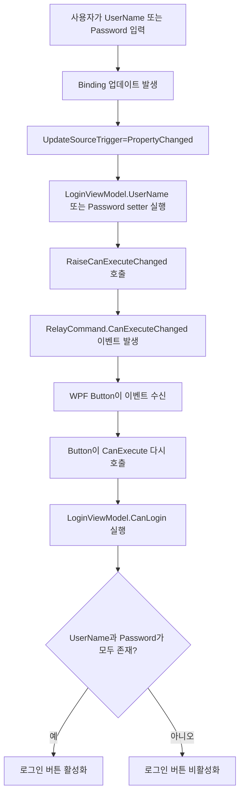

# WpfMvvmLearn Questions And Answers

## 1. UpdateSourceTrigger=PropertyChanged는 무엇인가?

질문:
`UpdateSourceTrigger=PropertyChanged`는 무엇인가?

답변:
`UpdateSourceTrigger=PropertyChanged`는 화면의 값이 바뀔 때마다 바인딩 원본, 즉 ViewModel 속성에 즉시 반영하라는 뜻이다.

예를 들어 아래와 같이 `TextBox`를 바인딩하면,

```xaml
<TextBox Text="{Binding UserName, UpdateSourceTrigger=PropertyChanged}" />
```

사용자가 글자를 한 글자 입력할 때마다 `UserName` 속성이 바로 갱신된다.

이 설정이 없거나 기본값이 `LostFocus`인 경우에는,
컨트롤에서 포커스가 빠질 때까지 ViewModel 값이 갱신되지 않을 수 있다.

현재 로그인 예제에서는 입력할 때마다 버튼 활성화 여부를 즉시 바꿔야 하므로 `PropertyChanged`가 적절하다.

## 2. RaiseCanExecuteChanged()이 실행되면 무엇이 일어나는가?

질문:
`RaiseCanExecuteChanged()`이 실행되면 무엇이 일어나는가?

답변:
`RaiseCanExecuteChanged()`는 명령 자체를 실행하는 함수는 아니다.
대신 "이 커맨드가 지금 실행 가능한지 다시 확인하라"는 신호를 UI에 보내는 역할을 한다.

현재 `RelayCommand`에서는 아래처럼 구현되어 있다.

```csharp
public void RaiseCanExecuteChanged()
{
    CanExecuteChanged?.Invoke(this, EventArgs.Empty);
}
```

즉 `CanExecuteChanged` 이벤트를 발생시키고,
이 이벤트를 구독하고 있는 버튼 같은 UI 컨트롤이 `CanExecute()`를 다시 호출해서 활성화 상태를 갱신한다.

## 3. CanExecuteChanged는 CanExecute와 어떻게 연결되어 있는가?

질문:
`CanExecuteChanged`는 `CanExecute`와 어떻게 연결되어 있는가?

답변:
둘은 `ICommand` 인터페이스 안에서 한 세트로 동작한다.

구성 요소의 역할은 다음과 같다.

1. `CanExecute()`
   현재 커맨드가 실행 가능한지 `true`, `false`로 판단한다.
2. `Execute()`
   실제 명령을 실행한다.
3. `CanExecuteChanged`
   실행 가능 여부가 바뀌었을 수 있으니 다시 확인하라고 알리는 이벤트다.

WPF의 `Button`은 `Command`에 바인딩된 객체를 `ICommand`로 보고,
내부적으로 `CanExecuteChanged`를 구독한다.
그리고 이벤트가 발생하면 `CanExecute()`를 다시 호출해서 버튼의 `IsEnabled` 상태를 바꾼다.

즉,

1. `CanExecuteChanged`는 알림 이벤트
2. `CanExecute()`는 실제 판단 함수

라는 관계다.

## 4. 로그인 폼에서 실제로는 어떤 순서로 동작하는가?

질문:
현재 로그인 폼에서 `UserName`, `Password`, `LoginCommand`는 실제로 어떤 순서로 동작하는가?

답변:
현재 로그인 폼에서는 다음 순서로 동작한다.

1. 사용자가 `TextBox` 또는 `PasswordBox`에 값을 입력한다.
2. `UpdateSourceTrigger=PropertyChanged` 때문에 `UserName` 또는 `Password` 속성이 즉시 갱신된다.
3. 속성 setter 안에서 `RaiseCanExecuteChanged()`가 호출된다.
4. `RelayCommand`가 `CanExecuteChanged` 이벤트를 발생시킨다.
5. 로그인 버튼이 이 이벤트를 받고 `CanExecute()`를 다시 호출한다.
6. 내부적으로 `CanLogin()`이 실행된다.
7. `UserName`과 `Password`가 모두 비어 있지 않으면 버튼이 활성화된다.

## 5. 로그인 버튼 활성화 흐름 다이어그램

아래 Mermaid 다이어그램은 현재 로그인 MVVM 예제에서 입력과 버튼 활성화가 어떻게 연결되는지 보여준다.



## 6. 핵심 요약

질문:
지금 로그인 폼 MVVM에서 꼭 기억해야 할 핵심은 무엇인가?

답변:
핵심은 다음 네 가지다.

1. `Binding`은 화면과 ViewModel을 연결한다.
2. `UpdateSourceTrigger=PropertyChanged`는 입력값을 즉시 ViewModel에 반영한다.
3. `RaiseCanExecuteChanged()`는 버튼에게 실행 가능 여부를 다시 확인하라고 알린다.
4. `CanExecute()`는 실제로 버튼이 활성화될지 비활성화될지를 판단한다.